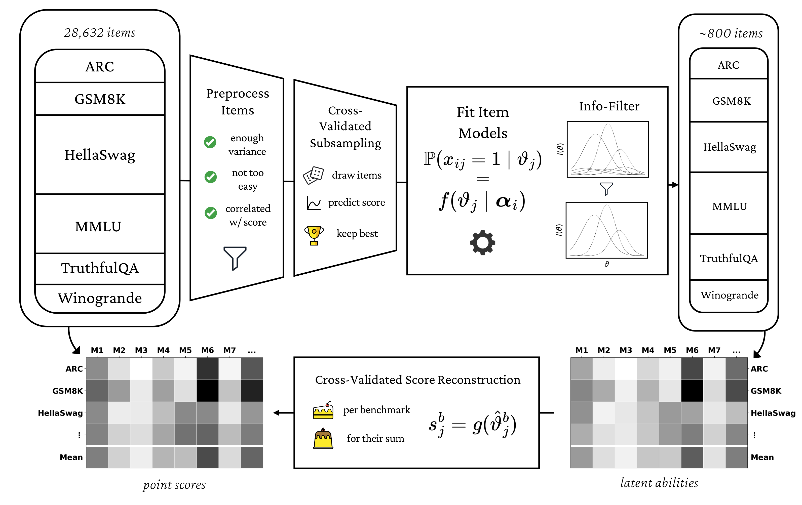

# metabench - a sparse benchmark to measure general ability in LLMs
Based on item response theory analyses of over 5000 LLMs, 𝚖𝚎𝚝𝚊𝚋𝚎𝚗𝚌𝚑 distills the [Open LLM Leaderboard 1](https://huggingface.co/spaces/open-llm-leaderboard-old/open_llm_leaderboard) to less than 3% of its original size, while being able to reconstruct the original score with 0.6% mean absolute error.

This repo contains the source code for [dataset scraping](scraping) in Python and [statistical analysis](analysis) in R. For details, please read our [preprint](https://arxiv.org/abs/2407.12844).

### Analysis Pipeline

